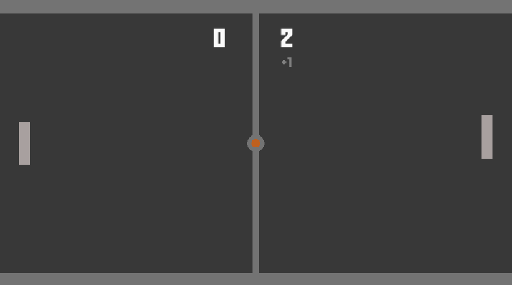
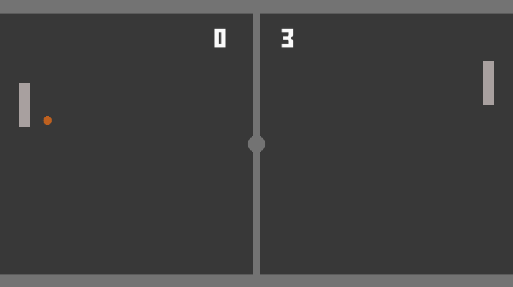
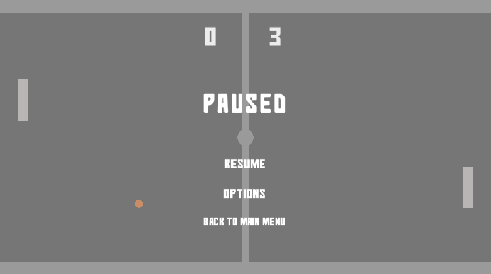

# Pong-Prototype
Classic pong prototype with custom player and enemy AI behavior.

## Features

- P1 vs P2 mode.
- P1 vs CPU mode.
- Start and pause menus.
- Basic sound effects.

  
  &nbsp;&nbsp;&nbsp;
  
  &nbsp;&nbsp;&nbsp;
  

## Dowonloads and Game Documents

⬇️: [Downloadable build](build)

📑: [Documents](docs)

- Game Design Document with possible new feature.
- Power interaction chart for new player power ups.

